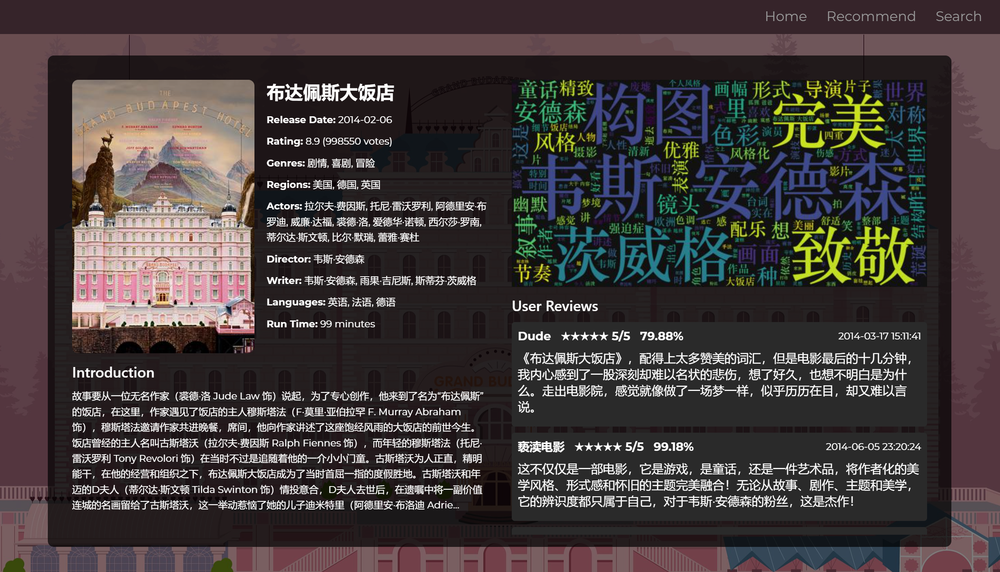
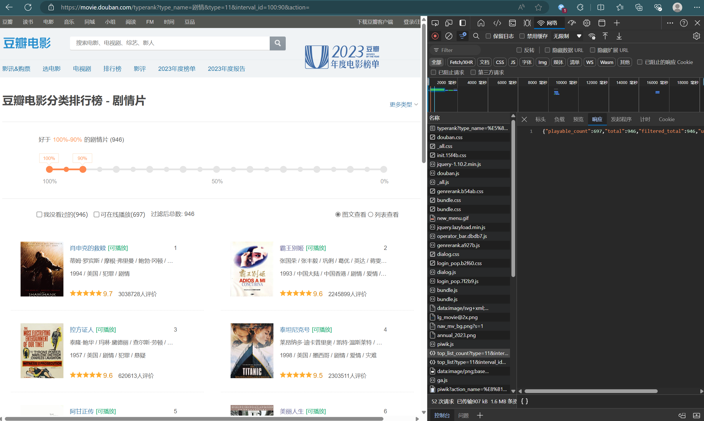
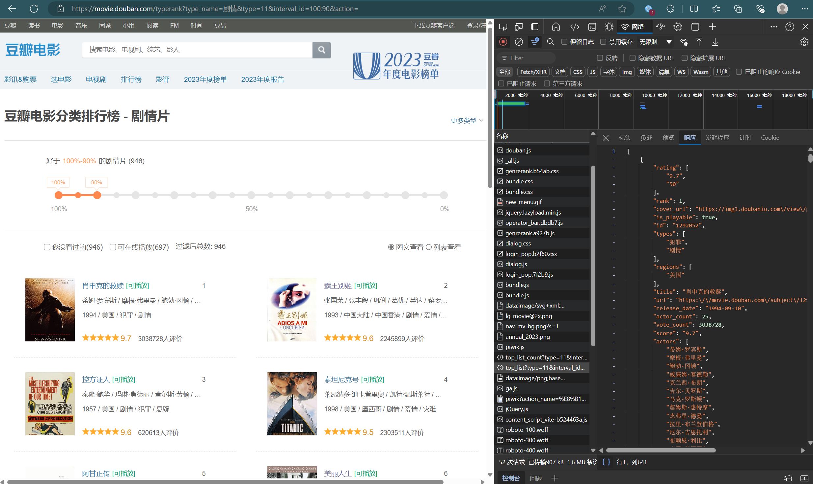
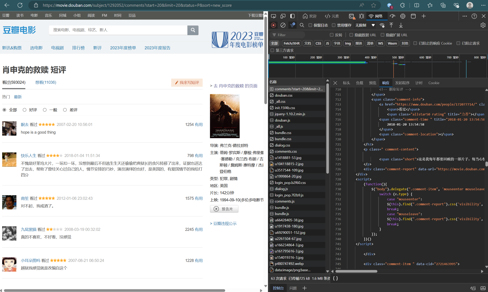

# Python 期末大作业

202201073040 数据新闻 王韵怡

## 0.概述

### 爬虫

使用`requests`库和`BeautifulSoup`库编写了爬虫脚本，爬取了豆瓣网电影信息，并存储在了本地`sqlite3`数据库中，数据表格式如下：

```json
{
  "id": "11525673",
  "title": "布达佩斯大饭店",
  "actors": ["拉尔夫·费因斯", "托尼·雷沃罗利", "阿德里安·布罗迪", "威廉·达福", "裘德·洛", "爱德华·诺顿"],
  "cover_url": "https://img3.doubanio.com/view/photo/s_ratio_poster/public/p2183539003.jpg",
  "directors": ["韦斯·安德森"],
  "languages": ["英语", "法语", "德语"],
  "regions": ["美国", "德国", "英国"],
  "release_date": "2014-02-06",
  "runtime": "99",
  "score": "8.9",
  "summary": "故事要从一位无名作家（裘德·洛 Jude Law 饰）说起，为了专心创作，他来到了名为“布达佩斯”的饭店，在这里，作家遇见了饭店的主人穆斯塔法（F·莫里·亚伯拉罕 F. Murray Abraham 饰），穆斯塔法邀请作家共进晚餐，席间，他向作家讲述了这座饱经风雨的大饭店的前世今生。",
  "types": ["剧情", "喜剧", "冒险"],
  "url": "https://movie.douban.com/subject/11525673/",
  "vote_count": "998550",
  "writers": ["韦斯·安德森", "雨果·吉尼斯", "斯蒂芬·茨威格"],
  "comments": [
    {
      "username": "Dude",
      "content": "《布达佩斯大饭店》，配得上太多赞美的词汇，但是电影最后的十几分钟，我内心感到了一股深刻却难以名状的悲伤，想了好久，也想不明白是为什么。走出电影院，感觉就像做了一场梦一样，似乎历历在目，却又难以言说。",
      "time": "2014-03-17 15:11:41",
      "score": "5",
      "like_num": "6964",
      "positive_rate": "0.7987686991691589"
    }
  ]
}
```

<div style="page-break-after:always;"></div> 

### 前端

为了更加直观地展现电影信息，使用`Next.js`框架编写了前端页面，并分别使用`wordcloud`库和`roberta`情感二分类模型对电影评论完成了数据分析。

#### 首页


#### 推荐页


<div style="page-break-after:always;"></div> 

#### 搜索页


#### 信息页



<div style="page-break-after:always;"></div> 

### 仓库结构

```
hw
├── movie # next.js框架
├── ref # 报告内用图
├── src # 源代码
│   ├── check_movie.py # 检查数据库信息，调试用
│   ├── create_cloud.py # 绘制词云图
│   ├── create_mood.py # 计算积极情感概率
│   ├── get_comment.py # 爬取电影评论
│   ├── get_cover.py # 爬取电影封面
│   ├── get_info.py # 爬取电影信息
│   └── save_comment.py # 将评论写入数据库
├── report.md # 报告
├── report.pdf # 报告
├── stopwords.txt # 停用词表
```

### 远程仓库地址

Please refer to the following repos:

https://github.com/cloudd-11/douban_crawler

因为github仓库容量有限制，所以数据库文件`movies.db`, `movieonly.db`, 停用词表`stopwords.txt`, 封面图库`images/`, 词云图库`wordclouds/`都托管在huggingface。

## 1.爬虫

### 1.1 爬取电影信息

在电影分类排行榜网站渲染时，观察到浏览器访问了`https://movie.douban.com/j/chart/top_list_count?type=11&interval_id=100%3A90&action=`，随后网站返回了以下格式的`json`，可以用以得到该分类下的电影总数:

```json
{"playable_count":697,"total":946,"filtered_total":946,"unwatched_count":946}
```



另外观察到浏览器后续访问了`https://movie.douban.com/j/chart/top_list?type=11&interval_id=100%3A90&action=&start=0&limit=20`，网站返回了对应范围[0,20]的电影信息，示例如下：

```json
[
    {
        "rating": [
            "9.7",
            "50"
        ],
        "rank": 1,
        "cover_url": "https://img3.doubanio.com\/view\/photo\/s_ratio_poster\/public\/p480747492.jpg",
        "is_playable": true,
        "id": "1292052",
        "types": [
            "犯罪",
            "剧情"
        ],
        "regions": [
            "美国"
        ],
        "title": "肖申克的救赎",
        "url": "https:\/\/movie.douban.com\/subject\/1292052\/",
        "release_date": "1994-09-10",
        "actor_count": 25,
        "vote_count": 3038728,
        "score": "9.7",
        "actors": [
            "蒂姆·罗宾斯",
            "摩根·弗里曼",
            "鲍勃·冈顿",
            "威廉姆·赛德勒",
            "克兰西·布朗"
        ],
        "is_watched": false
    }
]
```



因此在`get_info.py`中构造了循环，每次获取20个电影的信息，并保存在本地数据库。

#### 导入库

```python
import requests
import sqlite3
import json
import time
import threading
from queue import Queue
from tqdm import tqdm
import concurrent.futures
```

- `requests`用于进行`HTTP`请求
- `sqlite3`用于操作`SQLite`数据库
- `json`用于处理`JSON`数据
- `time`用于时间处理
- `threading`用于多线程
- `Queue`用于线程间通信
- `tqdm`用于显示进度条
- `concurrent.futures`用于线程池管理

#### 定义HTTP请求头

```python
headers = {
    'User-Agent': 'Mozilla/5.0 (Windows NT 10.0; Win64; x64) AppleWebKit/537.36 (KHTML, like Gecko) Chrome/58.0.3029.110 Safari/537.3',
    'Accept-Language': 'en-US,en;q=0.9',
    'Accept-Encoding': 'gzip, deflate, br',
    'Connection': 'keep-alive'
}
```

模拟浏览器请求头以避免被反爬虫机制挡住。

#### 全局队列

```python
movie_queue = Queue()
```

用于存放电影数据的线程安全队列。

#### 获取电影总数的函数

```python
def fetch_total_count(url, headers):
    try:
        response = requests.get(url, headers=headers)
        response.raise_for_status()
        return response.json().get('total', 0)
    except (requests.exceptions.RequestException, ValueError):
        print(f"Failed to fetch total count from {url}")
        return 0
```

通过访问前一类url获取指定分类的电影总数。

#### 插入电影数据到数据库

```python
def insert_movie(c, movie):
    movie_id = movie['id']
    c.execute('SELECT COUNT(*) FROM movies WHERE id=?', (movie_id,))
    if c.fetchone()[0] > 0:
        return
    if 'rank' in movie:
        del movie['rank']
    c.execute(''' ... ''', (movie['id'], json.dumps(movie['rating']), ...))
    c.connection.commit()
```

将电影数据插入到数据库，JSON字段进行序列化存储。

#### 获取电影数据函数

```python
def fetch_movies_data(interval_id, t, headers):
    with tqdm(total=total, desc=f"Type {t}, Interval {interval_id}") as pbar:
        while start < total:
            url = f'{base_url}&start={start}&limit={limit}'
            try:
                response = requests.get(url, headers=headers)
                response.raise_for_status()
                movies = response.json()
                for movie in movies:
                    movie_queue.put(movie)
                start += limit
                pbar.update(len(movies))
                time.sleep(0.1)
            except (requests.exceptions.RequestException, ValueError) as e:
                print(f"Failed to fetch or process data: {e}")
                break
```

分区间获取电影数据并放入队列，通过请求后一个url不断获取电影数据，并更新进度条。

#### 数据库写入线程

```python
def database_writer():
    conn = sqlite3.connect('movies.db')
    c = conn.cursor()
    c.execute('''CREATE TABLE IF NOT EXISTS movies (... )''')
    while True:
        movie = movie_queue.get()
        if movie is None: 
            movie_queue.task_done()
            break
        insert_movie(c, movie)
        movie_queue.task_done()
    conn.close()
```

从队列中取出电影数据并写入数据库，直到接收到终止信号 None。

#### 主函数

```python
def main():
    intervals = [(i, i - 10) for i in range(100, 0, -10)]
    types = [i for i in range(1, 32) if i not in [9, 21, 26]]
    writer_thread = threading.Thread(target=database_writer)
    writer_thread.start()
    with concurrent.futures.ThreadPoolExecutor() as executor:
        futures = []
        for t in types:
            for start_interval, end_interval in intervals:
                interval_id = f"{start_interval}%3A{end_interval}"
                futures.append(executor.submit(fetch_movies_data, interval_id, t, headers))
        for future in concurrent.futures.as_completed(futures):
            future.result()
    movie_queue.join()
    movie_queue.put(None)
    writer_thread.join()
    print("All movies have been processed.")
```

初始化并启动数据库写入线程，然后启动多个线程以并行爬取不同类型和区间的电影数据，等待所有数据处理完成后，发送终止信号并等待写线程结束。

```python
types = [i for i in range(1, 32) if i not in [9, 21, 26]]
```

以上范围限制是因为9、21、26对应的分类页不存在，推测是被豆瓣废弃的电影分类。

#### 结果

通过以上脚本，爬取并存储了本地电影信息数据库，大小为103.29mb.

### 1.2 爬取电影封面

观察到电影数据表中存在如下键值对：

```json
"cover_url": "https://img3.doubanio.com\/view\/photo\/s_ratio_poster\/public\/p480747492.jpg"
```

因此在`get_cover.py`中遍历所有电影，访问封面url资源地址，并将图片保存在本地。

#### 下载图片函数

```python
def download_image(record):
    cover_url = record[0]
    if cover_url:
        try:
            file_name = cover_url.split('/')[-1]
            save_path = os.path.join('images', file_name)

            if not os.path.exists(save_path):
                print(save_path)
                headers = headers

                response = requests.get(cover_url, headers=headers, stream=True)
                response.raise_for_status()

                with open(save_path, 'wb') as file:
                    for chunk in response.iter_content(1024):
                        file.write(chunk)
                
                time.sleep(random.uniform(0.5, 1.5))
        except requests.RequestException as e:
            print(f"Failed to download {cover_url}: {e}")
```

接收一个封面url后，下载并保存图片到本地，并且会检查图片是否已经存在以避免重复下载。

#### 主函数

```python
def fetch_and_download_images():
    conn = sqlite3.connect('movies.db')
    c = conn.cursor()
    
    c.execute('SELECT cover_url FROM movies')
    records = c.fetchall()
    
    if not os.path.exists('images'):
        os.makedirs('images')

    for record in tqdm(records, desc="Downloading images"):
        download_image(record)

    conn.close()
```

主函数从数据库中获取所有电影的封面URL，创建用于存储图片的目录，通过 tqdm 库展示进度条，然后逐个调用 download_image 函数下载图片。

#### 结果

通过以上脚本，爬取并存储了所有电影的封面，总共31571个jpg文件。

### 1.3 爬取电影评论

观察到访问评论页面时，浏览器会访问`https://movie.douban.com/subject/1292052/comments?start=0&limit=20&status=P&sort=new_score`并得到前20条评论。



为了降低存储压力，将阈值改为120，每部电影只存储热度最高的前120条评论。

#### 获取电影数据

```python
def get_movie_data():
    db_path = 'movie-site/movie/db/movies.db'
    conn = sqlite3.connect(db_path)
    cursor = conn.cursor()
    cursor.execute('SELECT id, url FROM movies')
    movies = [{'id': row[0], 'url': row[1]} for row in cursor.fetchall()]
    conn.close()
    return movies
```

从电影数据库中获取所有电影的ID和URL，并以字典列表的形式返回。

#### 提取评分

```python
def extract_score(score_class):
    match = re.search(r'allstar(\d{2})', score_class)
    if match:
        return int(match.group(1)) // 10
    return None
```

从评分的CSS类名中提取分数。例如，CSS类名 allstar40 表示4星评分。

#### 爬取评论内容

```python
def fetch_and_store_comments(movie):
    movie_id, movie_url = movie['id'], movie['url']
    comments_url = f"{movie_url}comments?percent_type=&start=0&limit=120&status=P&sort=new_score&comments_only=1"

    headers = headers
    response = requests.get(comments_url, headers=headers)
    if response.status_code == 418:
        print("error")
    thetime.sleep(random.uniform(1, 3))
    soup = BeautifulSoup(response.text.replace(r'\"', '"').replace(r'\n', ''), 'html.parser')

    comments_data = []
    for comment_div in soup.select('.comment-item'):
        try:
            username = comment_div.select_one('.comment-info a').text.strip()
            content = comment_div.select_one('.comment-content .short').text.strip()
            time = comment_div.select_one('.comment-time').text.strip()
            score = extract_score(comment_div.select_one('.comment-info .rating')['class'][0])
            like_num = int(comment_div.select_one('.comment-vote .votes').text.strip())
            comments_data.append({
                'movie_id': movie_id,
                'username': username.encode('utf-8').decode('unicode-escape'),
                'content': content.encode('utf-8').decode('unicode-escape'),
                'time': time,
                'score': score,
                'like_num': like_num
            })
        except Exception as e:
            print(f"Error processing comment: {e}")

    return comments_data
```

获取指定电影的评论，解析HTML内容，并提取评论的用户信息、评论内容、时间、评分和点赞数，然后将这些数据以字典形式存储在列表中并返回。

#### 主函数

```python
movies = get_movie_data()
all_comments = []

with ThreadPoolExecutor(max_workers=10) as executor:
    futures = {executor.submit(fetch_and_store_comments, movie): movie for movie in movies}
    for future in tqdm(as_completed(futures), total=len(futures), desc="Fetching comments"):
        try:
            comments = future.result()
            all_comments.extend(comments)
        except Exception as e:
            print(f"An error occurred: {e}")

with open('new_movie_comments.json', 'w', encoding='utf-8', errors='ignore') as f:
    json.dump(all_comments, f, ensure_ascii=False, indent=4)

print("Comments scraping and saving completed.")
```

- 获取电影数据：调用 get_movie_data() 获取所有电影信息。
- 初始化线程池：ThreadPoolExecutor 用于并行处理多个电影评论的抓取。
- 提交任务：使用 executor.submit 提交抓取评论的函数并将其纳入到 futures 字典中。
- 处理返回结果：通过 tqdm 监控进度，在任务完成后将结果收集到 all_comments 列表中。
- 保存数据：将所有评论数据保存到 new_movie_comments.json 中，设置 ensure_ascii=False 以保存非ASCII字符，并格式化JSON文件。

#### 结果

由于提取出的评论内容可能存在None，提交数据库操作可能存在报错风险，因此额外将数据临时存放到了另一个json中。事实证明确实提交失败，需要再从json文件中清洗数据重新提交。

通过以上脚本，爬取了所有电影热度最高的前120条评论，大小为570.31mb.

### 1.4 重新提交评论

将评论从临时存储的json文件提交到数据库中。

#### 按电影id归类评论

```python
classified_comments = {}
for comment in comments:
    movie_id = comment.pop("movie_id")  # 移除movie_id列
    if movie_id not in classified_comments:
        classified_comments[movie_id] = []
    classified_comments[movie_id].append(comment)
```

- 将评论按 movie_id 归类。每个 movie_id 对应一个评论列表。
- comment.pop("movie_id") 移除 movie_id 列，因为后续将 movie_id 作为字典的键。

#### 检查comments列是否存在

```python
cursor.execute("PRAGMA table_info(movies)")
columns = [info[1] for info in cursor.fetchall()]
if 'comments' not in columns:
    cursor.execute("ALTER TABLE movies ADD COLUMN comments TEXT")
    conn.commit()
```

检索 movies 表的列信息，查看是否已经包含 comments 列。如果没有，则添加 comments 列。

- PRAGMA table_info(movies) 获取表结构信息。
- 如果 comments 列不存在，则使用 ALTER TABLE 语句添加该列。

#### 更新数据库中的评论字段

```python
for movie_id, movie_comments in classified_comments.items():
    cursor.execute(
        "UPDATE movies SET comments = ? WHERE id = ?",
        (json.dumps(movie_comments, ensure_ascii=False), movie_id)
    )
```

遍历归类好的评论，将每部电影的评论更新到对应电影记录的 comments 字段中。

- json.dumps(movie_comments, ensure_ascii=False) 将评论列表转换为 JSON 字符串，并设置 ensure_ascii=False 以保持非 ASCII 字符。
- 使用 UPDATE 语句将 JSON 字符串插入到数据库中。

#### 结果

通过以上脚本，重新提交了电影评论内容并存储到了本地数据库中，大小为640.02mb.

## 2.词云图

为了可视化展现每部电影的重点内容，对每部电影的所有评论整合、分词、删除停用词并绘制了词云图并保存到本地。

停用词表来源网络，额外针对本项目添加了如下频繁无意义词：

```
最近 当前 电影 一部 故事 这部 说 中 真的
```

### 导入库

```python
import sqlite3
import jieba
from wordcloud import WordCloud
import matplotlib.pyplot as plt
import os
import re
from tqdm import tqdm
import json
from concurrent.futures import ThreadPoolExecutor
```

- `sqlite3` 用于操作 `SQLite` 数据库。
- `jieba` 用于中文分词。
- `wordcloud` 用于生成词云图。
- `matplotlib.pyplot` 用于绘图。
- `os` 和 `re` 用于文件和目录操作，正则表达式处理。
- `tqdm` 用于显示进度条。
- `json` 用于处理 `JSON` 格式数据。
- `concurrent.futures` 用于并发处理。

### 读取停用词

```python
stopwords_path = 'stopwords.txt'
with open(stopwords_path, 'r', encoding='utf-8') as f:
    stopwords = set([line.strip() for line in f.readlines()])
```

### 连接到数据库

```python
db_path = 'movie-site/movie/db/movies.db'
conn = sqlite3.connect(db_path)
cursor = conn.cursor()

# 查询所有电影的id和对应评论内容
cursor.execute("SELECT id, comments FROM movies")
movies = cursor.fetchall()
print(f"Total movies: {len(movies)}")
```

连接电影数据库，查询所有电影的ID及其评论内容。

### 处理评论数据

```python
movie_comments = {}
non_none_comments_count = 0

for movie in movies:
    movie_id, comments = movie
    if comments is not None:
        non_none_comments_count += 1
        try:
            comments_list = json.loads(comments)
            for comment in comments_list:
                content = comment.get("content", "")
                if isinstance(content, str):
                    content = content
                elif isinstance(content, bytes):
                    content = content.decode('utf-8')
                if movie_id in movie_comments:
                    movie_comments[movie_id] += ' ' + content
                else:
                    movie_comments[movie_id] = content
        except (json.JSONDecodeError, UnicodeEncodeError) as e:
            print(f"Error processing comments for movie_id {movie_id}: {e}")
```

遍历数据库中的电影记录，处理评论内容，将同一电影的评论文本合并。

### 过滤非文字字符

```python
def filter_non_chinese(text):
    return re.sub(r'[^\u4e00-\u9fa5]+', ' ', text)
```

### 生成并保存词云图

```python
for movie_id, texts in tqdm(movie_comments.items(), desc="Generating wordclouds"):
    output_file = os.path.join(output_dir, f'{movie_id}.jpg')
    if os.path.exists(output_file):
        print(f"Wordcloud for movie_id {movie_id} already exists.")
        continue
    try:
        text_filtered = filter_non_chinese(texts)
        wordlist = jieba.cut(text_filtered, cut_all=False)

        words_filtered = [word for word in wordlist if word not in stopwords]
        txt = ' '.join(words_filtered)
        
        wordcloud = WordCloud(
            font_path='./movie-site/movie/public/fonts/华文中宋.ttf',
            background_color='#111111',
            width=1600,
            height=800,
            margin=2
        ).generate(txt)
        
        fig, ax = plt.subplots()
        ax.imshow(wordcloud, interpolation='bilinear')
        ax.axis('off')
        plt.subplots_adjust(left=0, right=1, top=1, bottom=0)
        plt.savefig(output_file, bbox_inches='tight', pad_inches=0)
        plt.close()
    except Exception as e:
        print(f'Error generating wordcloud for movie_id {movie_id}: {e}')
```

遍历每部电影的评论数据，使用 `jieba` 进行分词，过滤掉停用词和非中文字符，使用 `WordCloud` 生成词云图，并保存为图片。

### 结果

通过以上脚本，给保存了评论的电影生成了词云图，总共19500个jpg文件，总共耗时4小时15分钟。

有三分之一的电影没有爬取到评论，这是因为从排行榜上获取的电影id与实际有评论内容的电影界面id已经不对应了，推测豆瓣发生过数据库id列的变更。但考虑到这些不符合的电影基本都是偏冷门的电影，因此没有再进一步完成评论补完操作。


## 3.情感分析

`uer/roberta-base-finetuned-jd-binary-chinese` 是由 `UER-py` 项目发布的一个中文情感分析模型。该模型在名为 `JD Binary` 的数据集上进行了微调，可以用于判断中文文本的情感倾向。该模型基于 `roberta-base` 架构，是一个预训练的语言模型。`RoBERTa（Robustly optimized BERT approach）`是 `BERT` 模型的优化版本，它在更大规模的数据集和更长时间的训练过程中表现出更好的性能。该模型在 `JD Binary` 数据集上进行了微调。`JD Binary` 是一个从京东商品评论中提取的数据集，包含正面和负面的评论数据，专门用于二分类任务的情感分析。

为了更准确地体现评论数据的情感态度，使用该模型为数据库中每个评论文本进行了情感分析。

### 导入库

```python
import sqlite3
import json
from tqdm import tqdm
from transformers import BertTokenizer, BertForSequenceClassification
import torch
import torch.nn.functional as F
```

- `sqlite3` 用于操作 `SQLite` 数据库。
- `json` 用于处理 `JSON` 格式的数据。
- `tqdm` 用于显示进度条。
- `transformers` 用于加载预训练的 `BERT` 模型和分词器。
- `torch` 和 `torch.nn.functional` 用于处理张量计算和模型推理。

### 加载模型和分词器

```python
model_name = "uer/roberta-base-finetuned-jd-binary-chinese"
tokenizer = BertTokenizer.from_pretrained(model_name)
model = BertForSequenceClassification.from_pretrained(model_name)
```

加载 `RoBERTa` 预训练的模型和分词器。

### 情感预测函数

```python
def predict_sentiment(sentence):
    inputs = tokenizer(sentence, return_tensors="pt", truncation=True, padding=True)
    inputs = {key: value.to(device) for key, value in inputs.items()}
    with torch.no_grad():
        outputs = model(**inputs)
    probs = F.softmax(outputs.logits, dim=-1)
    positive_probability = probs[0][1].item()
    return positive_probability
```

- 使用分词器对输入句子进行编码。
- 将输入数据移动到 GPU 上。
- 通过 model 进行推理，获取预测输出。
- 计算情感的积极概率。

### 更新数据库函数

```python
def update_database(db_path):
    conn = sqlite3.connect(db_path)
    cursor = conn.cursor()
    cursor.execute("SELECT id, comments FROM movies")
    rows = cursor.fetchall()

    for row in tqdm(rows, desc="Processing movies", unit="movies"):
        movie_id, comments_json = row
        if comments_json is None:
            continue
        comments = json.loads(comments_json)

        for comment in tqdm(comments, desc=f"Processing comments for movies {movie_id}", leave=False, unit="comment"):
            content = comment["content"][:512]
            positive_rate = predict_sentiment(content)
            comment["positive_rate"] = positive_rate

        updated_comments_json = json.dumps(comments, ensure_ascii=False)
        cursor.execute("UPDATE movies SET comments = ? WHERE id = ?", (updated_comments_json, movie_id))

    conn.commit()
    conn.close()
```

- 连接到 `SQLite` 数据库并获取所有电影记录。
- 遍历每部电影及其评论，预测每条评论的积极情感概率，并通过 `tqdm` 显示进度。
- 将带有预测概率的新评论数据更新到数据库中。

### 结果

为每条评论生成了积极情感概率，设备为一张3070ti，总共用时9小时35分钟。

```
当年的奥斯卡颁奖礼上，被如日中天的《阿甘正传》掩盖了它的光彩，而随着时间的推移，这部电影在越来越多的人们心中的地位已超越了《阿甘》。每当现实令我疲惫得产生无力感，翻出这张碟，就重获力量。毫无疑问，本片位列男人必看的电影前三名！回顾那一段经典台词：“有的人的羽翼是如此光辉，即使世界上最黑暗的牢狱，也无法长久地将他围困！”
99.16%

给一颗星的原因是没有负分。编剧和导演全体精神错乱的产物。我国内地公安在这个影片里公开打酱油……全体演员智商归零！
0.58%
```

## 4.前端界面

使用Next.js编写了一个展示电影信息的网站。

